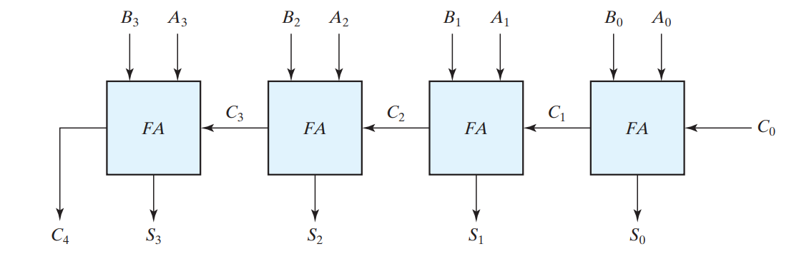

# Adder-Subtractor-Circuits

Parametrized Verilog implementation of different architectures of adder / subtractor circuits.

## Table of Contents

1. [Parameter Description](#parameter-description)
2. [Port Description](#port-description)
3. [Ripple Carry Adder](#ripple-carry-adder)
4. [Carry Lookahead Adder](#carry-lookahead-adder)
5. [Carry Select Adder](#carry-select-adder)
6. [Carry Bypass Adder](#carry-bypass-adder)
7. [Functional Verification](#functional-verification)
8. [References](#references)

## Parameter Description

All the implemented adders are parametrized using the following parameters.

<table>
    <tr>
        <th>Parameter</th>
        <th>Definition</th>
        <th>Default Value</th>
    </tr>
    <tr>
        <td>DATA_WIDTH</td>
        <td>The size of the two operands being added.</td>
        <td align="center">16</td>
    </tr>
    <tr>
        <td>BLOCK_SIZE</td>
        <td>This parameter is used in: carry lookahead adder, carry select adder, and carry bypass adder. It quantifies the number of full adders in one block (number of bits being added in one block). It is equivalent to the DATA_WIDTH parameter of each instantiated ripple carry adder module which is used to build all the other adders (but with small DATA_WIDTH value).</td>
        <td align="center">4</td>
    </tr>
</table>

## Port Description

All the implemented adders have the same IO interface but there may be some ports that are specific to a certain architecture (such as the generate and propagate signals).

<table>
    <tr>
        <th>Port</th>
        <th>Direction</th>
        <th>Width</th>
        <th>Description</th>
    </tr>
    <tr>
        <td>A</td>
        <td>input</td>
        <td>parametrized: DATA_WIDTH</td>
        <td>The first operand of the adder</td>
    </tr>
    <tr>
        <td>B</td>
        <td>input</td>
        <td>parametrized: DATA_WIDTH</td>
        <td>The second operand of the adder</td>
    </tr>
    <tr>
        <td>Cin</td>
        <td>input</td>
        <td align="center">1</td>
        <td>The initial carry bit. It may be used in case of subtraction (the second operand is inverted and the input carry bit is set to one to negate the number by using the 2's complement).</td>
    </tr>
    <tr>
        <td>CF</td>
        <td>output</td>
        <td align="center">1</td>
        <td>Carry flag bit. It is used to detect arithmetic overflows in unsigned systems.</td>
    </tr>
    <tr>
        <td>OF</td>
        <td>output</td>
        <td align="center">1</td>
        <td>Overflow flag bit. It is used to detect overflows in signed systems.</td>
    </tr>
    <tr>
        <td>S</td>
        <td>output</td>
        <td>parametrized: DATA_WIDTH </td>
        <td>The resulting sum of the two operands.</td>
    </tr>
</table>

## Ripple Carry Adder

It is the most primitive multi-bit adder. It is composed of full adders connected serially in a chain. The carry-out from each adder is connected to the carry-in of the next adder. The following figure shows a 4-bit ripple carry adder.

The following figure shows the output waveform of a 4-bit ripple carry adder. Note that at some operations, overflow occured and overflow flag is asserted which justifies the wrong answers in signed operations.

## Carry Lookahead Adder

The fundamental reason that large ripple carry adders are slow is that the carry signals must propagate through every bit in the adder. A carry lookahead adder is another type of carry propagate adder that solves this problem by dividing the adder into blocks and providing circuitry to quickly determine the carry out of a block as soon as the carry-in is known. Thus it is said to look ahead across the blocks rather than waiting to ripple through all the full adders inside a block.

Define generate (G) and propagate (P) logic:
A full adder is said to generate a carry when the carry-out bit is equal to one regardless to the value of the carry-in and it is said to propagate a carry when the value carry-out equals the value of the carry-in. So, we can define the carry out of a full adder as follows:

$$
C_{out} = G + PC_{in}
$$

The carry generated from the i-th full adder in the ripple carry adder:

$$
C_{i + 1} = G_{i}+ PC_{i}
$$

It can be shown from the truth table of the full adder that:

$$
G_{i} = A_{i}B_{i}
$$

$$
P_{i} = A_{i} ⊕ B_{i}
$$

The generate and propagate logic are produced from the full adder (they are actually the outputs of the first half adder that is part of the full adder). This is illustrated in the following figure.

For a 4-bit ripple carry adder:

$$
C_{0} = C_{in} \text {(initial input carry)}
$$

$$
C_{1} = G_{0} + P_{0}C_{0}
$$

$$
C_{2} = G_{1} + P_{1}C_{1} = G_{1} + P_{1}(G_{0} + P_{0}C_{0}) = G_{1} + P_{1}G_{0} + P_{1}P_{0}C_{0}
$$

$$
C_{3} = G_{2} + P_{2}C_{2} = G_{2} + P_{2}(G_{1} + P_{1}G_{0} + P_{1}P_{0}C_{0}) = G_{2} + P_{2}G_{1} + P_{2}P_{1}G_{0} + P_{2}P_{1}P_{0}C_{0}
$$

$$
C_{4} = G_{3} + P_{3}C_{3} = G_{3} + P_{3}(G_{2} + P_{2}G_{1} + P_{2}P_{1}G_{0} + P_{2}P_{1}P_{0}C_{0}) = G_{3} + P_{3}G_{2} + P_{3}P_{2}G_{1} + P_{3}P_{2}P_{1}G_{0} + P_{3}P_{2}P_{1}P_{0}C_{0}
$$

It is obvious that all the carry bits can be evaluated once the two operands A and B (because G's and P's are functions in the operands) and the initial carry Cin are ready. But note that the logic that evaluates the carry bits becomes more complicated by increasing the number of full adders in a stage. By generalization on the previous equations, all carry signals can be generated given the previous carry bit and the G's and the P's.

The main building blocks of this adder are ripple carry adders and carry generators. The adder is divided into sections of a certain size (it is parametrized with the parameter `BLOCK_SIZE`). The number of the ripple carry adder and carry generator blocks is (DATA_WIDTH / BLOCK_SIZE). The carry generator calculates the carry bit for the next carry generator block and the next ripple carry adder block given the carry from the previous stage. Each ripple carry adder block evaluates its portion of the sum given only the initial carry for the block (the internal carries are propagated as the normal operation of the ripple carry adder). If the BLOCK_SIZE is small enough (rule of thumb: BLOCK_SIZE <= 4), the carry generator will be very fast (because the logic isn't very dense). This following figure shows the block diagram of carry lookahead adder with DATA_WIDTH = 16, BLOCK_SIZE = 4, and hence the number of ripple carry adder and carry generator blocks is 4.

The following figure shows the architecture of a 32-bit carry lookahead adder with BLOCK_SIZE = 4.

The carry generator module is parametrized to support any number of adders per stage. This is done using the following approach:

<ol>
    <li>Create a 2D wire array of size (BLOCK_SIZE + 1) * (BLOCK_SIZE + 1) (in this example, BLOCK_SIZE = 4)</li>
    <li>Initialize the array as follows by using assign statements: </li>
    <li>Fill each empty cell as follows: empty_cell = P[i - 1] & x where i is the row that contains the cell and x is an iterator that takes all the values of the previous row: </li>
    <li>Then continue as the described manner: </li>
    <li>The final carry bit of the carry generator is the bitwise OR of the last row (same equation as derived earlier).</li>
</ol>

Note that the missing cells (wires) are not used.

The following figure shows the output waveform of a 4-bit carry lookahead adder. Note that at some operations, overflow occured and overflow flag is asserted which justifies the wrong answers in signed operations.

## Carry Select Adder

The carry select adder (CSA) is designed to minimize the delay time required to produce the sum output. The adder is divided into sections of a certain size (it is parametrized with the parameter `BLOCK_SIZE`). Each section consists of two ripple carry adders, one have the carry-in equals to one and the other have the carry-in equals zero. Then the actual carry from the previous stage is used to select the correct sum and carry bits.

The main advantage of the CSA is its ability to perform parallel addition of multiple bits simultaneously, which makes it faster than other adder circuits. However, the main disadvantage of the CSA is its complexity and the number of gates required to implement it, which makes it more expensive than other adder circuits.

The following figure shows the block diagram of a 16-bit CSA with BLOCK_SIZE = 4.

The following figure shows the output waveform of a 4-bit carry select adder. Note that at some operations, overflow occured and overflow flag is asserted which justifies the wrong answers in signed operations.

## Carry Bypass Adder

A carry-bypass adder (also known as a carry-skip adder) is an adder implementation that improves on the delay of a ripple-carry adder with little effort compared to other adders. The following figure shows the structure of one block whose size equals five (i.e. BLOCK_SIZE = 5) that builds the carry-bypass adder.

We have reached the following formula for a 4-bit ripple carry adder in the analysis of the carry lookahead adder:

$$
C_{4} = G_{3} + P_{3}C_{3} = G_{3} + P_{3}(G_{2} + P_{2}G_{1} + P_{2}P_{1}G_{0} + P_{2}P_{1}P_{0}C_{0}) = G_{3} + P_{3}G_{2} + P_{3}P_{2}G_{1} + P_{3}P_{2}P_{1}G_{0} + P_{3}P_{2}P_{1}P_{0}C_{0}
$$

Then,

$$
C_{5} = G_{4} + P_{4}C_{4} = G_{4} + P_{4}(G_{3} + P_{3}G_{2} + P_{3}P_{2}G_{1} + P_{3}P_{2}P_{1}G_{0} + P_{3}P_{2}P_{1}P_{0}C_{0})
$$

$$
C_{5} = G_{4} + P_{4}G_{3} + P_{4}P_{3}G_{2} + P_{4}P_{3}P_{2}G_{1} + P_{4}P_{3}P_{2}P_{1}G_{0} + P_{4}P_{3}P_{2}P_{1}P_{0}C_{0}
$$

Note that the carry notations (indices) in the diagram is not the same as the ones used in the equations.

From the equation of `C5`, we can conclude the following:

 

If:

$$
P_{4}P_{3}P_{2}P_{1}P_{0} = 1
$$

This means that:

$$
G_{4} = 0 \text{, because }P_{4} = 1
$$

$$
G_{3} = 0 \text{, because }P_{3} = 1
$$

$$
G_{2} = 0 \text{, because }P_{2} = 1
$$

$$
G_{1} = 0 \text{, because }P_{1} = 1
$$

$$
G_{0} = 0 \text{, because }P_{0} = 1
$$

Then by substitution in the equation of `C5`:

$$
C_{5} = C_{0}
$$

This justifies the previously shown block diagram of the carry-bypass adder block where the final carry-out of the chain is multiplexed between two cases. If all five-bit position propagates are true, then the entire five-bit adder is propagating. In this case, the carry-out is chosen to be the carry-in. In any other case, the carry-out is chosen to be the output of the five-bit ripple carry adder. This adder is called a carry-bypass adder since there is a possibility that the carry will bypass the entire adder to become the carry-out.

The following figure shows a 20-bit carry-bypass adder with BLOCK_SIZE = 5.

The following figure shows the output waveform of a 4-bit carry bypass adder. Note that at some operations, overflow occured and overflow flag is asserted which justifies the wrong answers in signed operations.

## Functional Verification

All the implemented adders are verified through a generic testbench and an automated Python environment. The Python environment generates a huge number of test cases (input operands) along with their sum, carry flags, and overflow flags. It also runs the generic testbench several times where each time a single adder architecture is instantiated and tested. The testbench produces the sum, carry flags, overflow flags of all the test cases. Then the Python environment compares all the results with the expected results and confirms that the adder is functioning correctly. The implementation details of the functional verification module can be found at `functional_verification` directory. The verification module can be run by using the `functional_verification/run.tcl` script.

## References

<ol>
    <li><a href="https://www.sciencedirect.com/book/9780128000564/digital-design-and-computer-architecture" target="_blank">Digital Design and Computer Architecture</a></li>
    <li><a href="https://www.amazon.com/Digital-Design-Introduction-Verilog-HDL/dp/0132774208" target="_blank">Digital Design: With an Introduction to the Verilog HDL</a></li>
    <li><a href="https://link.springer.com/book/10.1007/978-3-030-37195-1" target="_blank">Handbook of Digital CMOS Technology, Circuits, and Systems</a></li>
    <li><a href="https://www.youtube.com/playlist?list=PLyWAP9QBe16qnuE-nw0RkUq0IwRkzqyhD" target="_blank">Electron Tube</a></li>
    <li><a href="https://ocw.mit.edu/courses/6-004-computation-structures-spring-2017/pages/c8/c8s2/c8s2v2/" target="_blank">MIT OCW</a></li>
</ol>
